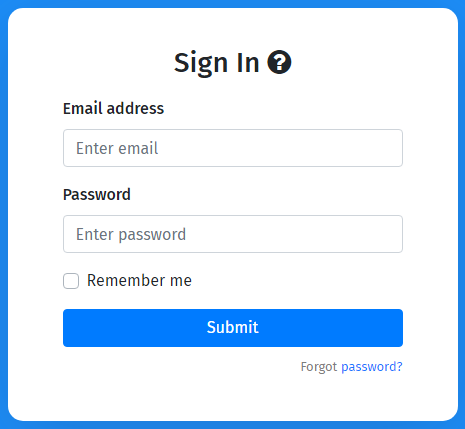
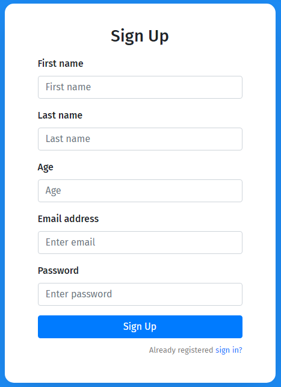

# This is a Fullstack React App

# Backend API endpoints

### GET All People

https://jwt-practice-backend.herokuapp.com/api/v1/people

### GET Single Person

https://jwt-practice-backend.herokuapp.com/api/v1/person

### POST A New Person

https://jwt-practice-backend.herokuapp.com/api/v1/register

### DELETE A Person

https://jwt-practice-backend.herokuapp.com/api/v1/person/delete

### PATCH (Update) A Person Info

https://jwt-practice-backend.herokuapp.com/api/v1/person/update

### PUT Login A Person

https://jwt-practice-backend.herokuapp.com/api/v1/person/login
